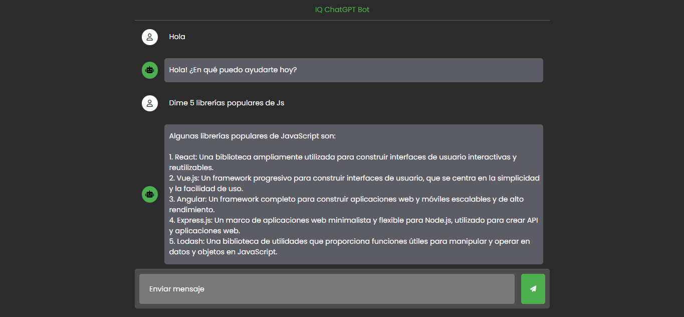

# IQ ChatGPT Bot

Proyecto ChatGPT utilizando HTML, CSS y JavaScript. La aplicación consume una API para obtener respuestas a las preguntas formuladas por el usuario. El usuario puede ingresar una pregunta en un campo de entrada y luego enviarla al bot. El bot procesa la pregunta utilizando la API y devuelve una respuesta, que se muestra en la interfaz de usuario. Esta aplicación proporciona una forma intuitiva y dinámica para interactuar con el bot y obtener respuestas a preguntas específicas en tiempo real.

